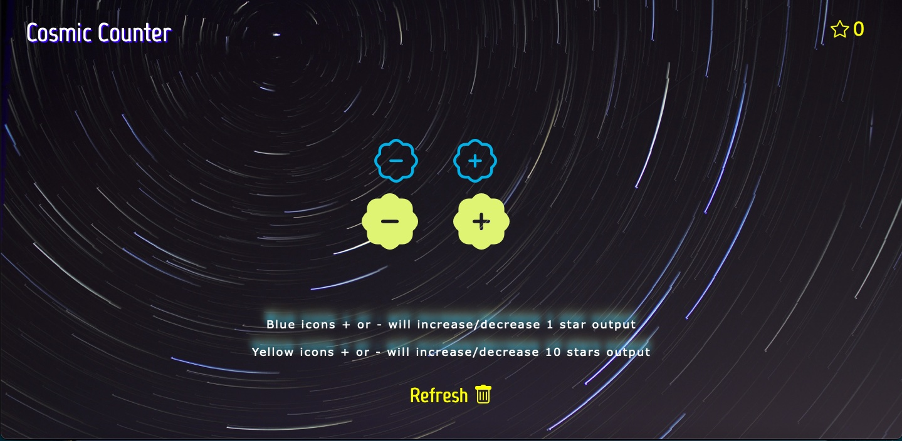

 # Cosmic Counter 💥
 
## Overview 📖
**Cosmic Counter** is a basic app using Javascript. Its main function is to increase or decrease the output. 

Talking about style, I decide to use an '80s flavour for the app that recalls to "Space Invader", an old famous game set in space.

Counter output is represented by an empty star, buttons are divided in two different colors:

* Blue buttonn increase/decrease the output of 1 unit.
* Yellow buttons increase/decraese the output of 10 units.

A the bottom of the page there's a Refresh button that allows to reset the output to 0.

I decided to put a little detail in order to surprise the user, when you reach 50 value the empty star get fulfilled.

**Just try!**

## Features 📝

This counter has been created using Javascript & Css.

In Css file I added media query to get a responsive design on mobile too.

## Link 🔗

Clicking on the image below you'll go quicly to the page:

## License 

Cosmic Counter is licensed by <a href= "https://github.com/BrunoArrostini/counter/blob/main/LICENSE.md"> MIT LICENSE.

